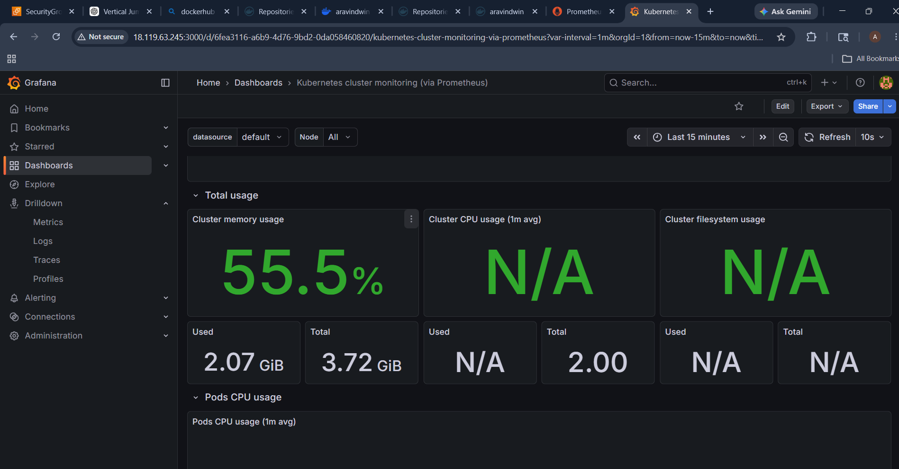
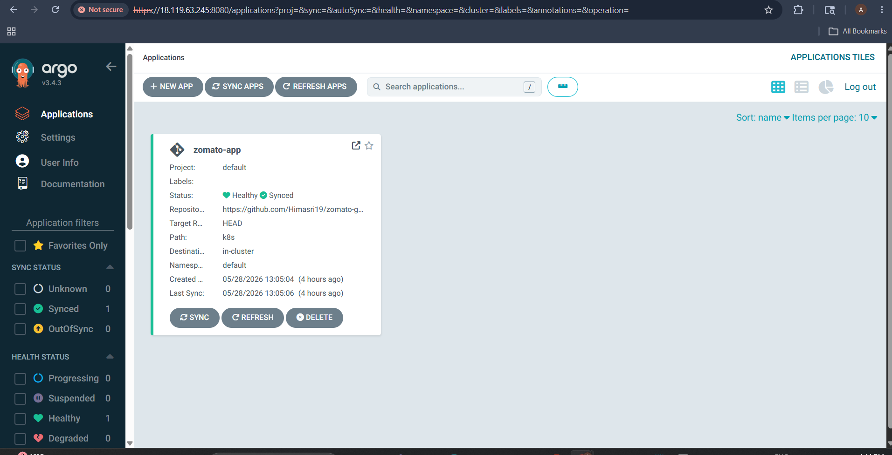
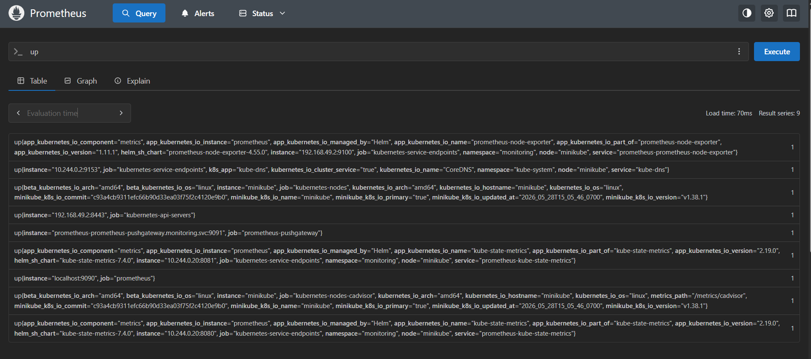
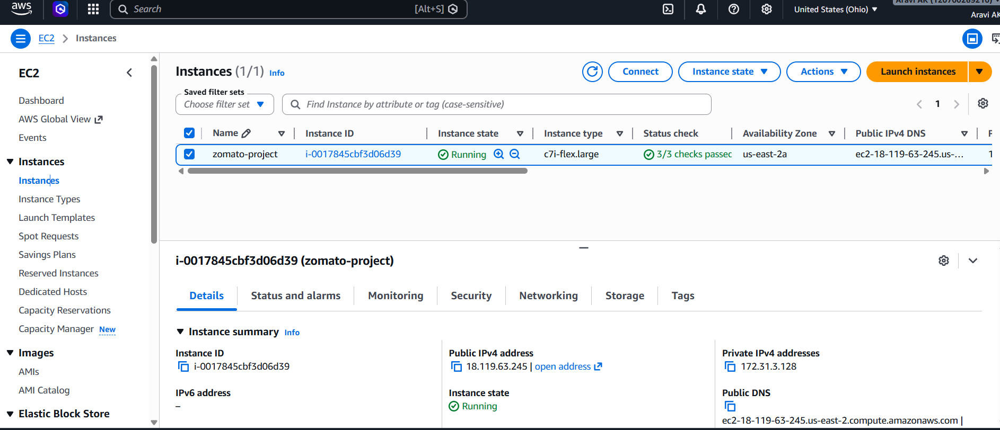
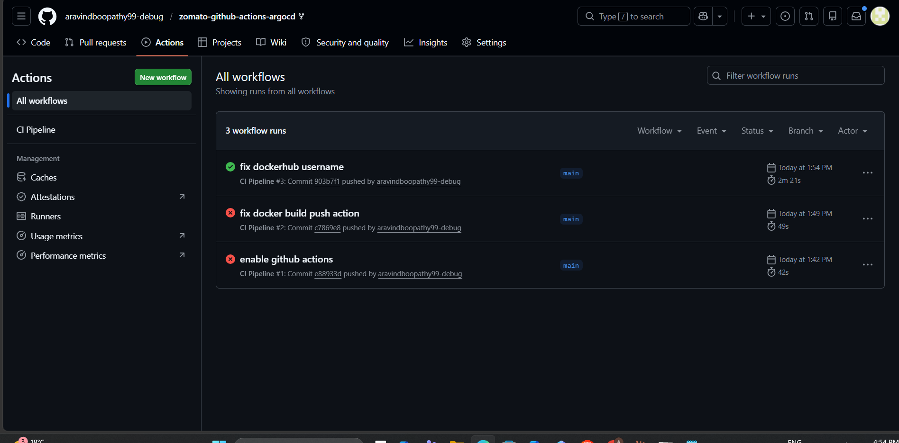
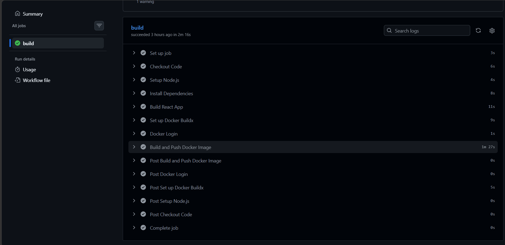
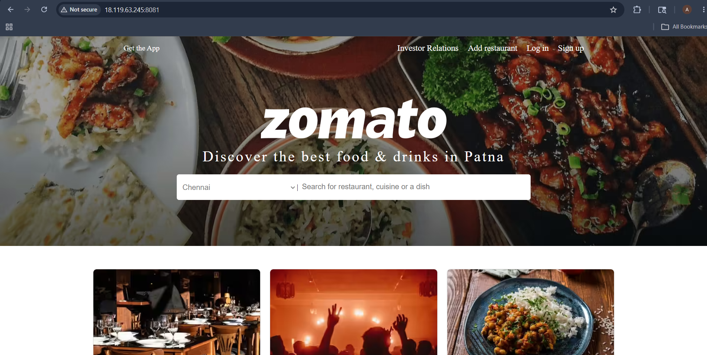
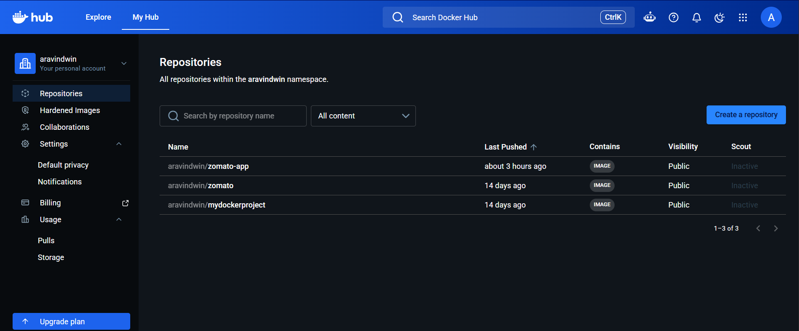
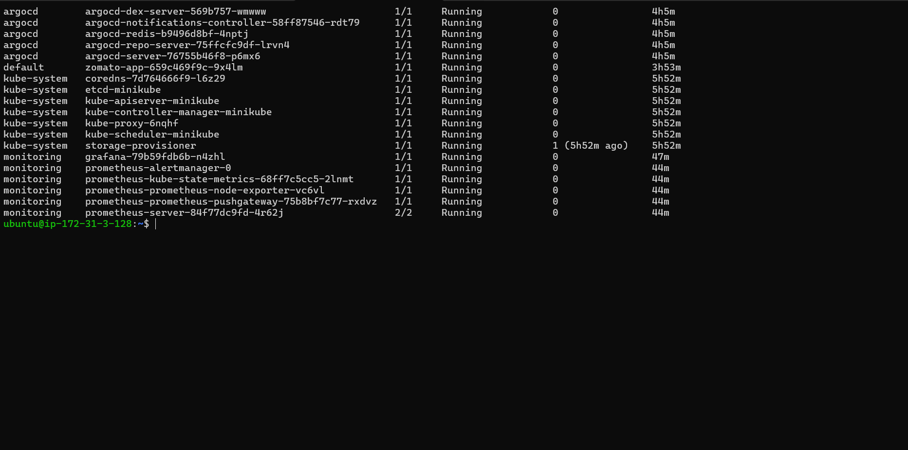
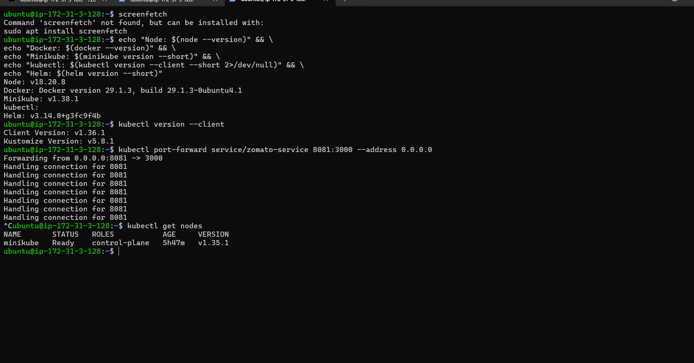

# 🍕 Zomato App — GitOps CI/CD with GitHub Actions, ArgoCD, Prometheus & Grafana

A production-grade DevOps project deploying a Zomato food delivery clone on AWS EC2 with Minikube Kubernetes, using a fully automated GitOps pipeline — from code push to live deployment with real-time monitoring.

---

## 🚀 Live Demo

> Application accessible at: `http://18.119.63.245:8081`
> *(AWS EC2 instance — may be stopped to avoid charges)*

---

## 🏗️ Architecture Overview

```
Developer Push (GitHub)
        │
        ▼
┌──────────────────────┐
│   GitHub Actions     │  ← CI Pipeline triggers on push to main
│   CI Pipeline        │
│   ✅ Succeeded 2m21s │
└──────────┬───────────┘
           │
    ┌──────┴──────────────────────────────┐
    │                                     │
    ▼                                     ▼
Build React App                    Build Docker Image
npm install + build                aravindwin/zomato-app:latest
    │                                     │
    └──────────────┬──────────────────────┘
                   │
                   ▼
         Push to Docker Hub ✅
         aravindwin/zomato-app
                   │
                   ▼
         Update k8s/deployment.yaml
         (new image tag in GitHub)
                   │
                   ▼
┌──────────────────────────────────┐
│         ArgoCD v3.4.3            │  ← Watches GitHub repo every 3 mins
│   Status: ✅ Healthy + Synced    │
│   App: zomato-app                │
│   Namespace: default             │
└──────────┬───────────────────────┘
           │
           ▼
┌──────────────────────────────────┐
│      Minikube Kubernetes         │  ← Running on AWS EC2 (c7i-flex.large)
│      v1.38.1 / k8s v1.35.1      │
│                                  │
│  Namespaces:                     │
│  ├── default (zomato-app) ✅     │
│  ├── argocd (5 pods) ✅          │
│  ├── monitoring (6 pods) ✅      │
│  └── kube-system (6 pods) ✅     │
└──────────┬───────────────────────┘
           │
           ▼
┌──────────────────────────────────┐
│   Prometheus + Grafana           │
│   Cluster Memory: 55.5%          │
│   9 services monitored ✅        │
│   Dashboard ID: 3119             │
└──────────────────────────────────┘
```

---

## 🛠️ Tech Stack

| Category | Tool | Version |
|---|---|---|
| Cloud | AWS EC2 | c7i-flex.large |
| OS | Ubuntu Server | 22.04 LTS |
| Container Runtime | Docker | 29.1.3 |
| Kubernetes | Minikube | v1.38.1 |
| K8s Client | kubectl | v1.36.1 |
| Package Manager | Helm | v3.14.0 |
| CI/CD | GitHub Actions | CI Pipeline |
| GitOps | ArgoCD | v3.4.3 |
| Container Registry | Docker Hub | aravindwin/zomato-app |
| Monitoring | Prometheus | via Helm |
| Dashboards | Grafana | Dashboard 3119 |
| App Framework | React + Node.js | Node v18.20.8 |

---

## 🔄 GitHub Actions CI Pipeline

The pipeline triggers automatically on every push to `main` branch.

| Step | Action | Time |
|---|---|---|
| ✅ Set up job | Prepare Ubuntu runner | 3s |
| ✅ Checkout Code | Pull latest code | 6s |
| ✅ Setup Node.js | Install Node 18 | 4s |
| ✅ Install Dependencies | npm install | 8s |
| ✅ Build React App | npm run build | 11s |
| ✅ Set up Docker Buildx | Modern Docker build | 9s |
| ✅ Docker Login | Authenticate to Docker Hub | 1s |
| ✅ Build and Push Docker Image | Push to aravindwin/zomato-app | 1m 27s |
| ✅ Complete job | | 0s |

**Total pipeline time: 2 minutes 21 seconds** ⚡

---

## 🐙 ArgoCD — GitOps Deployment

| Property | Value |
|---|---|
| Application Name | zomato-app |
| Status | ✅ Healthy + Synced |
| Repository | github.com/aravindboopathy99-debug |
| Path | k8s/ |
| Target Revision | HEAD |
| Destination | in-cluster |
| Namespace | default |
| ArgoCD Version | v3.4.3 |
| Last Sync | Automatic |

ArgoCD watches the GitHub repo every 3 minutes. When GitHub Actions updates `k8s/deployment.yaml` with a new Docker image tag, ArgoCD detects the change and automatically deploys it to Kubernetes — **zero manual steps**.

---

## ☸️ Kubernetes Cluster — All Pods Running

```
NAMESPACE    NAME                                    STATUS
argocd       argocd-dex-server                      ✅ Running
argocd       argocd-notifications-controller        ✅ Running
argocd       argocd-redis                           ✅ Running
argocd       argocd-repo-server                     ✅ Running
argocd       argocd-server                          ✅ Running
default      zomato-app                             ✅ Running
kube-system  coredns                                ✅ Running
kube-system  etcd-minikube                          ✅ Running
kube-system  kube-apiserver-minikube                ✅ Running
kube-system  kube-controller-manager-minikube       ✅ Running
kube-system  kube-proxy                             ✅ Running
kube-system  kube-scheduler-minikube                ✅ Running
monitoring   grafana                                ✅ Running
monitoring   prometheus-alertmanager                ✅ Running
monitoring   prometheus-kube-state-metrics          ✅ Running
monitoring   prometheus-node-exporter               ✅ Running
monitoring   prometheus-pushgateway                 ✅ Running
monitoring   prometheus-server                      ✅ Running
```

**Total: 18 pods — all Running ✅**

---

## 📊 Prometheus + Grafana Monitoring

| Metric | Value |
|---|---|
| Cluster Memory Usage | 55.5% |
| Memory Used | 2.07 GiB / 3.72 GiB |
| Services Monitored | 9 |
| Grafana Dashboard | Kubernetes Cluster Monitoring (ID: 3119) |
| Scrape Interval | Every 15 seconds |

**Prometheus targets monitored:**
- prometheus-node-exporter
- kube-dns / CoreDNS
- kubernetes-nodes
- kube-apiserver
- prometheus-pushgateway
- kube-state-metrics
- kubernetes-nodes-cadvisor
- prometheus itself

---

## 🐳 Docker Hub

| Repository | Last Pushed | Visibility |
|---|---|---|
| aravindwin/zomato-app | 3 hours ago | Public |
| aravindwin/zomato | 14 days ago | Public |

```bash
# Pull and run locally
docker pull aravindwin/zomato-app:latest
docker run -d -p 3000:3000 aravindwin/zomato-app:latest
```

---

## ☁️ AWS Infrastructure

| Property | Value |
|---|---|
| Instance Name | zomato-project |
| Instance Type | c7i-flex.large |
| Region | us-east-2 (Ohio) |
| OS | Ubuntu 22.04 LTS |
| Status | ✅ Running (3/3 checks passed) |
| Public IP | 18.119.63.245 |

---

## 🚀 How to Run This Project

### Prerequisites
- AWS Account
- GitHub account with Actions enabled
- Docker Hub account
- Basic Linux knowledge

### Step 1 — Launch EC2
```bash
# Instance: Ubuntu 22.04, c7i-flex.large, 20GB storage
# Open ports: 22, 80, 443, 8080, 8081, 9090, 3000, 30000-32767
```

### Step 2 — Install Tools on EC2
```bash
# Update server
sudo apt update && sudo apt upgrade -y

# Install Docker
sudo apt install -y docker.io
sudo usermod -aG docker ubuntu
newgrp docker

# Install Minikube
curl -LO https://storage.googleapis.com/minikube/releases/latest/minikube-linux-amd64
sudo install minikube-linux-amd64 /usr/local/bin/minikube

# Install kubectl
curl -LO "https://dl.k8s.io/release/$(curl -L -s https://dl.k8s.io/release/stable.txt)/bin/linux/amd64/kubectl"
sudo install -o root -g root -m 0755 kubectl /usr/local/bin/kubectl

# Install Helm
curl -LO https://get.helm.sh/helm-v3.14.0-linux-amd64.tar.gz
tar -zxvf helm-v3.14.0-linux-amd64.tar.gz
sudo mv linux-amd64/helm /usr/local/bin/helm
```

### Step 3 — Start Minikube
```bash
minikube start --driver=docker
kubectl get nodes
# Should show: minikube   Ready   control-plane
```

### Step 4 — Set GitHub Secrets
```
DOCKERHUB_USERNAME = aravindwin
DOCKERHUB_TOKEN    = <your docker hub access token>
```

### Step 5 — Push Code to Trigger Pipeline
```bash
git add .
git commit -m "trigger pipeline"
git push origin main
# GitHub Actions runs automatically ✅
```

### Step 6 — Install ArgoCD
```bash
kubectl create namespace argocd
kubectl apply -n argocd -f https://raw.githubusercontent.com/argoproj/argo-cd/stable/manifests/install.yaml
kubectl port-forward svc/argocd-server -n argocd 8080:443 --address 0.0.0.0
```

### Step 7 — Install Prometheus + Grafana
```bash
helm repo add prometheus-community https://prometheus-community.github.io/helm-charts
helm repo add grafana https://grafana.github.io/helm-charts
helm repo update
kubectl create namespace monitoring
helm install prometheus prometheus-community/prometheus --namespace monitoring
helm install grafana grafana/grafana --namespace monitoring
```

### Step 8 — Access Everything
```bash
# App
kubectl port-forward service/zomato-service 8081:3000 --address 0.0.0.0
# http://YOUR_EC2_IP:8081

# ArgoCD
kubectl port-forward svc/argocd-server -n argocd 8080:443 --address 0.0.0.0
# https://YOUR_EC2_IP:8080

# Prometheus
kubectl port-forward svc/prometheus-server 9090:80 -n monitoring --address 0.0.0.0
# http://YOUR_EC2_IP:9090

# Grafana
kubectl port-forward svc/grafana 3000:80 -n monitoring --address 0.0.0.0
# http://YOUR_EC2_IP:3000
```

---

## 📸 Screenshots

### Grafana — Kubernetes Cluster Monitoring


### ArgoCD — Healthy & Synced


### Prometheus — All Services UP


### AWS EC2 Instance Running


### GitHub Actions — CI Pipeline Succeeded


### GitHub Actions — Build Steps


### Zomato App Running on Kubernetes


### Docker Hub — Image Pushed


### All Kubernetes Pods Running


### kubectl get nodes


---

## 📚 Key Learnings

- Built a complete GitOps pipeline — code push to live deployment with zero manual steps
- Used GitHub Actions for CI and ArgoCD for CD — industry standard separation of concerns
- Deployed and managed 18 pods across 4 namespaces in Kubernetes
- Set up full observability stack with Prometheus scraping 9 services + Grafana dashboards
- Understood the difference between CI (GitHub Actions) and CD (ArgoCD/GitOps)
- Managed Docker multi-stage builds reducing image size for production

---

## 👨‍💻 Author

**Aravind Boopathy**
DevOps Engineer | AZ-104 | Terraform Associate
📍 Ontario, Canada
🔗 [LinkedIn](https://www.linkedin.com/in/aravind-boopathy-19049337a/)
🐳 [Docker Hub](https://hub.docker.com/u/aravindwin)

---

⭐ If you found this project useful, please give it a star!
